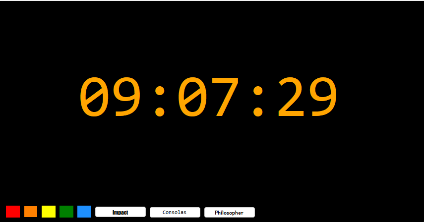

# Digital Clock⏰

Esse relógio foi feito utilizando **C#** seguindo um tutorial no Youtube do canal Shaun Halverson.

Decidi fazer esse relógio para praticar a linguagem de programação que venho aprendendo. 

## Aprendizado 👾
Durante o projeto aprendi melhor sobre os formulários e ***tick e click method*** utilizados pelo autor do vídeo. Além disso, também desenvolvi melhor noção da lógica por trás dos programas em c#

## Tecnologias utilizadas 👩🏻‍💻
- C#
- .NET framework

### DETALHES ✨
No APP é possível alterar a cor do relógio e a fonte de exibição clicando nos botões abaixo.

:)
